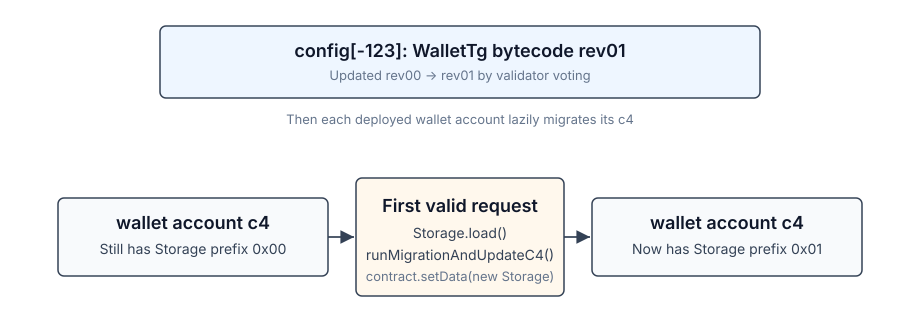

# WalletTg Storage Migrations



`WalletTg` bytecode is shared through `config[-123]`.
When a new bytecode revision appears in config after validators voting,
every trampoline starts jumping to the new logic immediately,
but each wallet account keeps its old `c4` cell.

The `c4` revision is the `0xXX` prefix of `Storage`. After a bytecode upgrade from
rev01 to rev02, an existing account still has `c4` prefix `0x01`, although struct `Storage` already has `0x02`.
On the first successful incoming request that reaches `Storage.load()`, the new bytecode decodes
the old layout `OldStorage_01`, writes the current `Storage`, and the persisted prefix becomes `0x02`.
So, the migration is done exactly once.

Get-methods also call `Storage.load()`, running a migration if `c4` is outdated,
but that does not commit `c4` — just allows the getter to run correctly.
The `revision()` getter intentionally reads the raw prefix.

Malformed messages that fail before `Storage.load()` do not migrate. Messages that
throw after a temporary migration do not persist it unless the transaction succeeds.

**Live demo implemented**: see Git branch `demo-rev01-rev02`.

## Core invariants

- `struct (0xXX) Storage` is the current storage layout.
- `Revision.RevXX_*` has the same numeric value as the `Storage` prefix.
- `LAST_REVISION` points to the current `Storage` prefix.
- `Storage.load()` is the only regular entry point that performs lazy migration.
- `OldStorage_XX` structs are decode-only snapshots. Do not modify them.
- Files `contracts/revisions-boc/WalletTg-revXX.boc` are immutable. Add a new file for the next revision.
- ABI-friendly due to `Storage | UnionOfOldStorages` correctly decoded by first 8 bits.

**Contract logic must be fully compatible with all old revisions**. This means:

- do not change existing messages, append only
- do not change get methods, append only

## Upgrade checklist

Reminder for developers: how to start developing the next `WalletTg` revision.

**Scenario: we have rev01 (which added flagX), start developing rev02 (new feature)**.

### 0. Set a new boc file destination

Update `Acton.toml` so `output` points to the new revision BoC:

```toml
[contracts.WalletTg]
output = "contracts/revisions-boc/WalletTg-rev02.boc"
```

Append in to the array for testing (grep `setWalletBytecodeInConfig` in tests):

```tolk
const ALL_REVISIONS_BOC_PATHS = array<string> [
    // ...
    "contracts/revisions-boc/WalletTg-rev02.boc",
]
```

### 1. Bump the revision

Update `revisions.tolk`.

```tolk
enum Revision : uint8 {
    Rev00_Initial = 0,
    Rev01_AddFlagX = 1,
    Rev02_NewFeature = 2,
}

const LAST_REVISION = Revision.Rev02_NewFeature
```

### 2. Freeze the previous storage shape

Before changing the current `Storage`, copy it into the old-layout struct to `OldStorage_XX`:

```tolk
struct (0x01) OldStorage_01 {
    /// also copy all comments above fields (for ABI)
    seqno: uint32
    subwalletId: uint32
    publicKey: uint256
    flagX: bool
}
```

Then add it to `UnionOfOldStorages`:

```tolk
type UnionOfOldStorages =
    | OldStorage_00
    | OldStorage_01
```

Historical structs must describe exactly what is already stored on-chain.

### 3. Update `Storage` prefix and fields

Bump the current `Storage` prefix and make the actual storage change:

```tolk
struct (0x02) Storage {
    seqno: uint32
    subwalletId: uint32
    publicKey: uint256
    flagX: bool = false
    /// append fields in the end only
    newFeatureField: uint32 = 0
}
```

Use default values in `Storage` for new fields. Do not change existing ones.

### 4. Add migration from the previous revision

Update `migration.tolk`.

```tolk
return match (old) {
    OldStorage_00 => Storage {
        // ... already existing code from 00 to Storage (to rev02 now)
        // newFeatureField is also auto-initialized with a default
    }
    OldStorage_01 => Storage {
          seqno: old.seqno,
          subwalletId: old.subwalletId,
          publicKey: old.publicKey,
          flagX: old.flagX,
          // newFeatureField is initialized with a default
    }
}
```

**Even when the storage shape remains unchanged** (only contract logic is changed/fixed),
**follow the same procedure**. `OldStorage_XX` will be a copy, without adding new fields. It's reasonable
to keep logical/c4 revisions in sync.

### 5. Messages and getters for a new feature

- add new request types to `AllowedInternalMsg` and/or `AllowedExternalMsg`
- handle them in `onInternalMessage` or `onExternalMessage`
- write `get fun` for public read API
- errors in `enum Error`

### 6. Extend tests

A simple example:

- a new wallet is deployed with last revision
- new messages are accepted
- `get new_feature` return expected results

Example of a testing scenario with migration:

- deploy rev01 to config
- deploy wallets X and Y, top up them
- assert rev01 feature flagX works
- assert rev02 messages fail and don't bump seqno
- update to rev02 in config
- both wallets `get revision` still 01
- send an invalid message
- still 01
- send a message through X to Y to execute a new feature
- both `get revision` are 02: both migrated
- `get new_feature` on X is default
- `get new_feature` on Y is activated

Besides `acton test`, inspect Fift code, examine diff against the previous revision.

### Side note about newly-deployed accounts

With rev02 active in config, a "create wallet" button from UI may still deploy a rev01 initial storage —
for example, the user has an outdated client, or in case of desync with Telegram backend.

This will also work: on the first valid message, that storage will be migrated.
