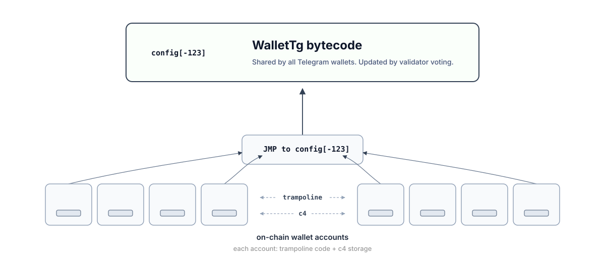
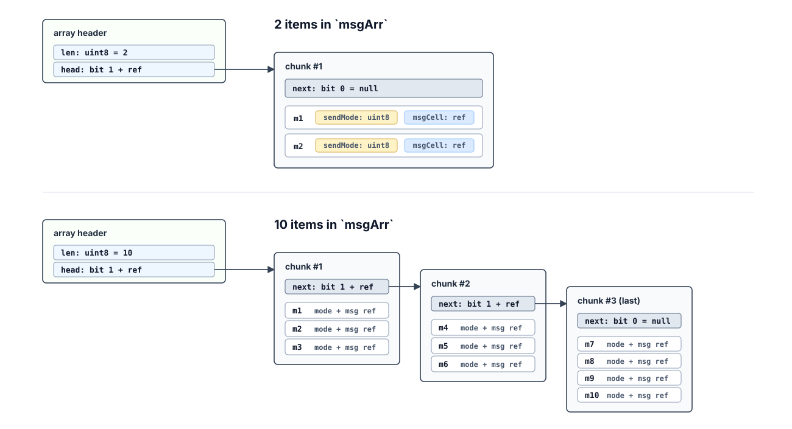

# Telegram Wallet TON Contract

Telegram wallet contract, written in Tolk and built with Acton.
Bytecode stays in config and is updated by validator voting.


## Architecture: two layers



Every deployed wallet does not store `WalletTg` as its account code. It stores a tiny immutable trampoline contract.

The trampoline does one thing: `JMP to config[-123]`, where the real `WalletTg` bytecode is stored — shared by all Telegram users.

This means:

- All Telegram wallets use the same latest wallet logic.
- The trampoline never changes; only the bytecode in config changes.
- Improvements of WalletTg apply to all Telegram users at once.
- No "update" action from the user, as well as no "disable updates".

Bytecode in config **can be updated by validator voting only**. Once validators voted, all wallets get new features. Every account storage in `c4` is migrated lazily.

`WalletTg` is essentially the shared on-chain backend. A client app can be outdated, but the contract remains backward compatible.

Sources:
- [Trampoline contract](contracts/WalletTrampoline.fif)
- [WalletTg contract (shared backend)](contracts/WalletTg/WalletTg.tolk)

The config index `-123` (negative) is chosen to avoid updating `block.tlb`.


## WalletTg is NOT wallet v5

`WalletTg` contract resembles a standard wallet contract.
It contains `seqno` and other protection against replay attacks.
It checks signature and forwards messages to TVM out actions.

But its implementation is fully different from a standard TON wallet.

WalletTg:
- does not support extensions (plugins)
- builds TVM c5 itself
- allows rotating the signing key

Why:
- 2fa and subscriptions to be implemented natively
- exposes a clearer API and reduces import fees
- Telegram creates a wallet, but allows switching to self-custody

Besides, WalletTg contract is ABI-friendly and developer-friendly.


## Storage and revisions

`WalletTg` is an updatable contract. When a new revision is released,

- bytecode is updated by validator voting, for all users at once
- data (storage) of each account is migrated lazily

If a revision appends new fields to storage schema, `c4` storage of each account contains old data until migrated.
Migration is launched once on the next request.

Even with storage shape changes, WalletTg stays ABI-friendly for explorers and dev tools — both before and after migration.

Read [MIGRATION.md](./MIGRATION.md).


## Signing any incoming request

Ordinary top-ups and malformed unauthenticated payloads are ignored without changing seqno.

Every sensible request must be signed by a private key (it's checked against `storage.publicKey`).

The client-side signing process has three steps (NB: **format differs from wallet v5**).
1. Compose some valid request (body).
2. Sign it with their private key (derived from a mnemonic) — resulting in `signature`.
3. Prepend the signature to the serialized request and send.

```tolk
/// Every internal/external incoming message has the format:
struct SignedRequest<T> {
    /// Signature of the body with the client's private key.
    signature: bits512
    /// Body of the incoming message (with opcode and data).
    request: T
}
```

Every internal/external request `T` starts with a header. For instance, it contains seqno to protect against replay attacks.

```tolk
struct SeqnoHeader {
    /// Must match `Storage.subwalletId`, so one key can control multiple wallets.
    subwalletId: uint32
    /// Unix timestamp until which the message is valid. Must be greater than `blockchain.now`.
    /// Protects against replay after expiration.
    validUntil: uint32
    /// Seqno protects against replay attacks. Must match `Storage.seqno`.
    seqno: uint32
}
```


## Sending ONE message

WalletTg has a special flow for the most common case: send a single message.
This reduces import fee and gas.

Internal messages may be used for gasless flows. External messages are the regular path.

```tolk
struct MessageToSend {
    sendMode: uint8
    messageCell: cell
}

struct (0x63896E74) SendOneMessageRequestI {
    header: SeqnoHeader
    msg: MessageToSend
}

struct (0x63896E75) SendOneMessageRequestE {
    header: SeqnoHeader
    msg: MessageToSend
}
```

External messages require the `SEND_MODE_IGNORE_ERRORS` flag.

Note: here and below, **internal and external structs differ only in opcodes**. Why not use a single struct?
This protects against a malicious gas relayer.
If a user signs an internal request for gasless, it should not be accepted as an external, draining contract's balance.

## Sending MANY messages (1-255)

A general request for N messages:

```tolk
struct (0x73896E74) SendBulkMessagesRequestI {
    header: SeqnoHeader
    msgArr: array<MessageToSend>
}

struct (0x73896E75) SendBulkMessagesRequestE {
    header: SeqnoHeader
    msgArr: array<MessageToSend>
}
```

The client sends a Tolk `array<MessageToSend>`.



Each `MessageToSend` item is stored in a chunk as `sendMode:uint8` plus `messageCell` (ref).
Intermediate chunks contain up to 3 items (the first ref is `next`).
The last chunk has no `next` ref and may contain 4 items.
Bulk requests reject an empty send list and accept up to 255 messages.

The contract parses this array and calls `sendRawMessage` for each item, building TVM `c5` itself.

**Such a scheme is MUCH cheaper than w5 in terms of import fee** (aka forward fee). Why:
- each message is not wrapped to an extra cell (c5 item wrapping messageCell)
- 3 messages per chunk in an array, 3 times less incoming cells

For 255 messages, this encoding saves ~0.2 cents on import fee.


## Changing the public key

The wallet can rotate its signing public key any number of times.
This covers the switching from Telegram custody and internal Telegram needs.

This is a special message signed by two keys:
1. signature of the message itself (current key)
2. a special "proof" signed by a new private key

For exact fields and proof format, dive into WalletTg sources.
Grep `ChangePublicKeyRequest` and `KeyRotationProofPayload`.


## Contract getters

WalletTg exposes:

- `get fun revision()`
- `get fun seqno()`
- `get fun get_subwallet_id()`
- `get fun get_public_key()`

`revision()` reads the current `c4` prefix directly. It does not trigger migration.
After bytecode upgrade, returns the old revision until the first valid incoming message migrates `c4`.


## Build and test

The project uses [Acton](https://ton-blockchain.github.io/acton/):

```bash
acton build
acton test
```

Regenerate the trampoline BOC with:

```bash
acton run build-trampoline
```
